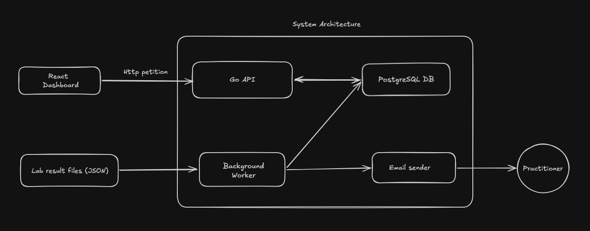
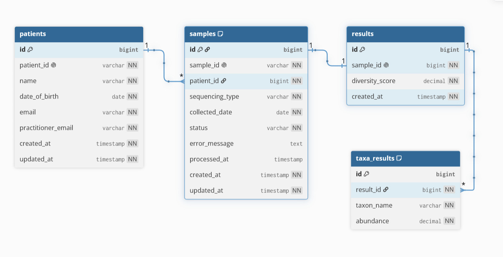
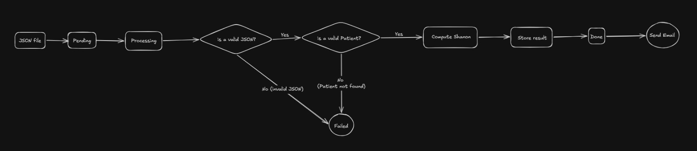

# Demo Microbiome Lab Platform

A reliable, scalable, and self-contained microbiome lab platform slice designed to ingest patient lab result files asynchronously, calculate microbial diversity scores, persist the structured data, and surface them through a responsive practitioner dashboard.

---

## System Architecture & Design

To understand how data flows through the system—from the initial ingestion of raw JSON/CSV files to the interactive user interface—please refer to the following architectural blueprints:

### High-Level Architecture



### Database Schema Model (PostgreSQL)



### Asynchronous Processing Pipeline (Worker)



---

## 🛠️ Tech Stack

- **Backend & Background Worker:** Go (Golang) 1.26
- **Frontend Dashboard:** React (TypeScript / Vite)
- **Database:** PostgreSQL
- **Orchestration & Containerization:** Docker & Docker Compose

---

## 🚀 Getting Started (How to Run)

Follow these exact steps to spin up the entire ecosystem on a fresh machine from a clean clone.

### Prerequisites

- Ensure you have **Docker** and **Docker Compose** installed and running on your system.

### Installation & Execution

1.  **Clone the repository:**

    ```bash
    git clone https://github.com/EdMarzal97/vitract_tech_assessment.git
    cd vitract-assessment
    ```

2.  **Launch the multi-container environment:**
    Run the following command from the root directory (where the `docker-compose.yml` file is located). This command builds the custom Go backend and React frontend images, provisions the PostgreSQL database, mounts the input data volumes, and links everything on an isolated network:

    ```bash
    docker compose up --build
    ```

3.  **Access the Applications:**
    - **Frontend Dashboard:** Open your browser at [http://localhost:3000](http://localhost:3000)
    - **Backend API Base URL:** [http://localhost:8080](http://localhost:8080)
    - **API Health Check:** [http://localhost:8080/health](http://localhost:8080/health)
